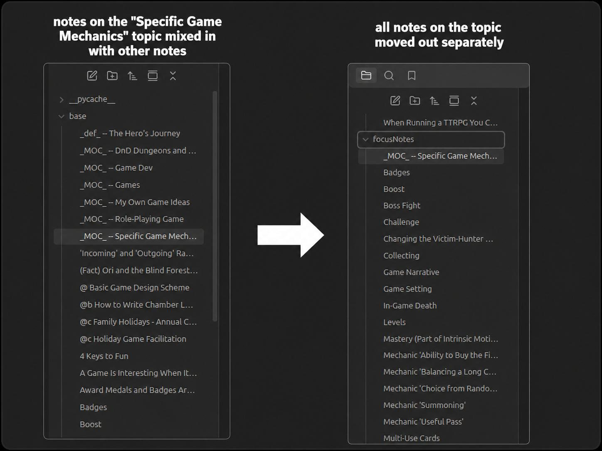
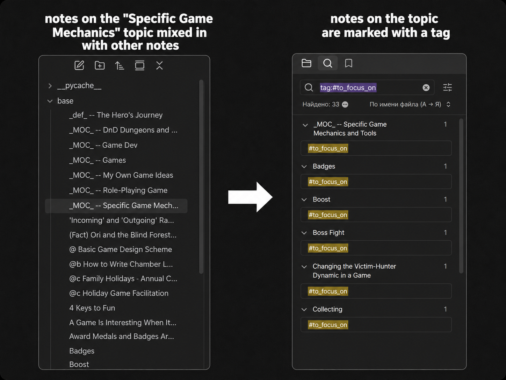
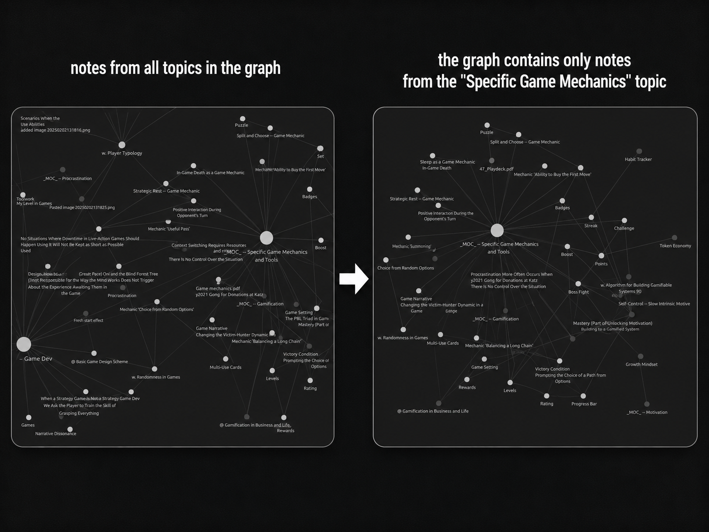
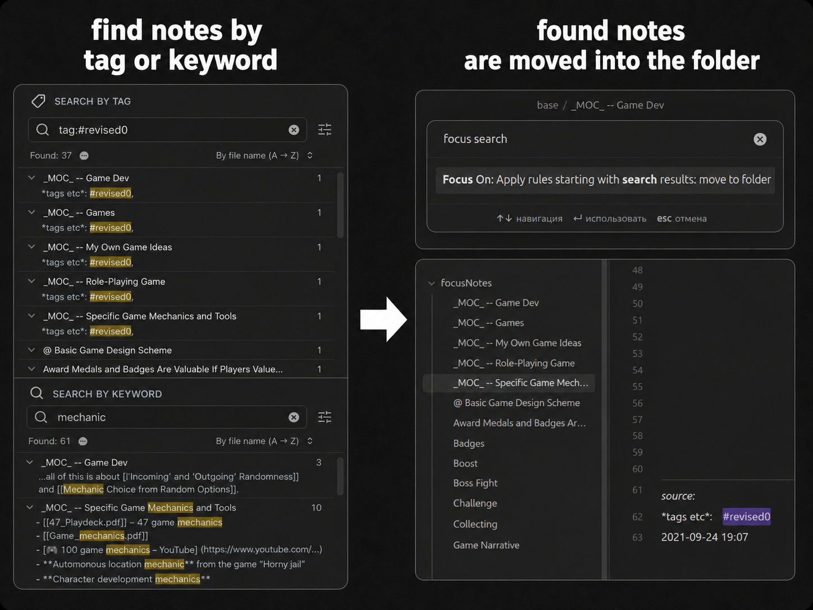
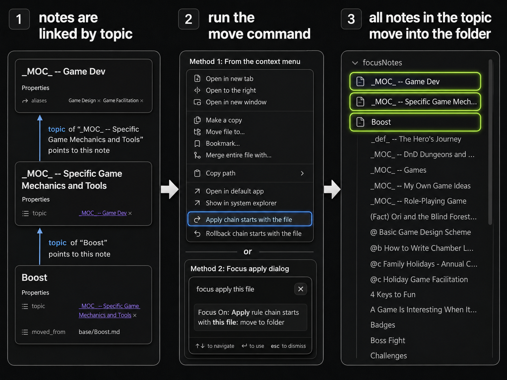
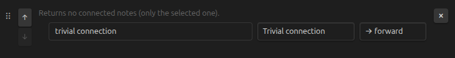
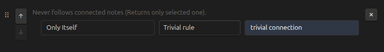

# Focus On
An [Obsidian.md plugin](https://obsidian.md/) for working with part of your Vault.

Want to focus on just one topic? This is the right plugin for it!

## Goal and setup
The goal of the plugin is to help you work with subtopics in a clear and simple way, regardless of how you define the structure in your vault.

Examples:
- Your Vault is about programming, and you want to focus on software architecture notes.
- Your Vault is about communication, and you want to focus on your notes about flirting.
- Your Vault is about personal projects, and you want to focus on one active project.

### What does it mean to "focus on notes"?

#### Put notes in one folder
Collect all notes on one topic in a specific folder.



P.S. You can use my other plugin, `Ignore Filters Boost`, to add every folder except the focused one to the ignore list.

#### Add one tag to notes
Mark all notes with a YAML tag or hashtag.



#### View marked notes in the graph
View the graph only for the selected topics.



### How to focus on notes

#### Globally: from search
(Case: you mark your topics with hashtags or put them in a folder.)



You can add any notes directly from search results. Just create a search query as specific as you need.


#### Locally: from connections
(Case: your notes have a tree-like structure.)



The main strength of the plugin is that it can follow connections between notes. If you use YAML tags or mark notes inside the text, the plugin will help you collect notes on the same topic.

### How to set it up
The plugin has two main concepts: "connections" and "rules".
#### Connections


- A "connection" is a way your notes are connected. There may be many options.
- Every connection has a title (make it unique) and a direction:
- The "forward" direction means we look at the note itself and the connections *from* the note. Example: you have a frontmatter `next` field to mark next notes.
- The "backward" direction means we look at the connections *to* the note. Example: you have a frontmatter `topic` field from children to parent, and you start with the parent to find all its children.

Connection types:
- `All links in text` — finds links in the note body (not in YAML). Example: you want to get all neighbors of the note.
- `All links in frontmatter` — finds links in the frontmatter header. Example: you want all structural notes.
- `Arbitrary (danger)` — put any code you want. Just create a Markdown file with a code block like the one below.
- `Between in text` — finds links between two text strings. Example: your "topic" is always at the end of the file after a `---` marker.
- `Regexp/prefix` — finds links right after some structure. Example: you use Dataview `topic:: <link>` text.
- `Top links in text` — finds links at the top of the note body. Example: you mark the topic as the first link in the note file.
- `Trivial connection` — put just this note; don't go through connections. Example: you already found all notes with search and want to work only with those found notes.
- `YAML tags` — finds links by YAML tag. Example: your topics are marked with the `topic` YAML tag.
- `Combine` — finds links based on a combination of connections. Example: you want to go through a YAML tag, but only if it doesn't have another tag.


Arbitrary connection example: put code like this in a `.md` file:
```javascript
// Read the contents of the current file
const content = await app.vault.read(node);

// Remove frontmatter
const contentWithoutFrontmatter = utils.removeFrontmatter(content);
console.log("ha!")

// Extract links
const links = utils.extractLinksFromString(contentWithoutFrontmatter);

// Get files from the links
const files = utils.getFilepaths(links, node, app);

// Return an array of files
return files;
```

#### Rules

- A "rule" defines what to do with a connection.

Rule types:
- `go to the end` — follow the connection to the end. Example: you want to take the whole tree.
- `N steps` — follow the connection only a few steps. Example: you want to take all the note's neighbors (1 step).
- `probability` — follow the connection with some probability. Example: you don't know what notes to add, so you try to select them with some probability.
- `Trivial rule` — ignore the connection and mark only the given note.

## How to use
1. Determine what connections exist inside your vault. Do you use frontmatter to structure anything, `topic::` style, or just mark the parent as the first link in the note?
2. Set up connections and rules.
3. Choose a start note and run the `apply chain` command, or just right-click the note.


## Future plans
- Feedback about how to identify subtopics in your Vault, what you want to do with those subtopics, and how to explain or improve the plugin concepts is warmly welcome!

The goal of the plugin is to help you work with subtopics in a clear and simple way, regardless of how you define the structure in your vault. Please help improve it!
